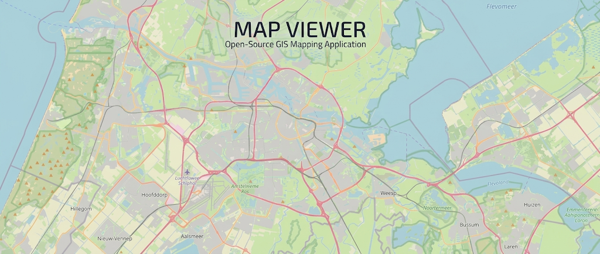

<h1 align="center">Geo Three Scene Demo App</h1>

<p align="center">
  
</p>

## About

Geo Three Scene is a debugging tool for map tiles. It shows which tiles a Cesium globe loaded, which ones failed, and what data they carry.

The main view is a Cesium globe centered on Amsterdam. It draws OpenStreetMap raster tiles served from the project's own `public/tiles` folder, not from an external tile server. Each time Cesium loads a tile or fails to load one, the app records it. A small Three.js scene, built with React Three Fiber, shows these records in the corner of the screen.

### Tile overlay

The overlay stacks tiles by zoom level. Each level sits on its own plane, and a labeled depth axis marks the zoom level of each plane. Tiles that failed to load are always shown. Successfully loaded tiles are shown when **Active tiles in scene** is on.

- **Hover** a tile in the overlay to highlight the same area on the globe. A tooltip shows the tile's `z/x/y`, URL, error message, bounds and size in kilometers.
- **Click** a tile to fly the camera to it, if **Fly to tile on click** is on.
- **Rotate and zoom** the overlay's 3D scene with the mouse. The overlay camera refocuses on its own as new tiles appear, but stops once you move it yourself.
- **Move and resize** the overlay by dragging it and its corners.

### Globe tools

- **Tile grid on globe** draws Cesium's tile boundaries and `z/x/y` labels on top of the map.
- **GLB tiles (3D)** loads matching glTF tiles from `public/tiles_glb`. They're used only as a data source and are never rendered. With **Enable GLB metadata** on, clicking the globe opens a card with the tile's properties, read from the glTF `EXT_structural_metadata` extension.
- **Map controls** in the corner reset the view and zoom in or out. Gauges show the camera's heading, pitch, roll, longitude and latitude. The footer shows the camera height, the current level of detail and the number of error tiles.

### Panels

- **Analytics** lists loaded and failed tiles for each zoom level. Click a row to fly to the area covered by that level.
- **Network** shows Core Web Vitals for the page (FCP, LCP, INP, CLS, TTFB) with their ratings. For LCP, INP and CLS it can point to the page element that caused the value.

### DOOM on a tile

**Play DOOM** replaces the image of the first loaded tile with a live DOOM game running in the js-dos emulator. Keyboard input goes to the game only while the cursor is over that tile. This is a proof of concept for putting live video on a Cesium map tile.

### Simulated errors

The dev server always returns 404 for a few tiles, so there are failed tiles to inspect. You can change the list in `ERROR_TILES` in [vite.config.mjs](vite.config.mjs). The deployed build doesn't do this. There, only tiles missing from `public/tiles` fail.

**Stack:** React, TypeScript, Vite, Cesium, Three.js, React Three Fiber, drei.

## Getting started

### Requirements

- Node.js 20.19+ or 22.12+ (required by Vite 8)
- npm

### Install

```bash
git clone https://github.com/alex-shostka/GEO_THREE_SCENE.git
cd GEO_THREE_SCENE
npm install
```

The map tiles, GLB tiles and Cesium static assets are already in `public/`, so you don't need to download anything else.

### Run

```bash
npm run dev       # dev server at http://localhost:5173
```

### Build

```bash
npm run build     # production build into dist/
npm run preview   # serve the build locally
```

### Optional: re-download map tiles

The repo already includes the tiles, so you only need this to change the area or the zoom levels. [download_tiles.py](download_tiles.py) downloads OpenStreetMap raster tiles into `public/tiles/{z}/{x}/{y}.png`. That's the same path the app loads them from, so it picks them up without any other changes.

**1. Install Python dependencies.** You need Python 3 and two packages. A virtual environment is recommended:

```bash
python3 -m venv .venv
source .venv/bin/activate        # Windows: .venv\Scripts\activate
pip install mercantile requests
```

**2. Set the area and zoom levels.** Edit the config block at the top of `download_tiles.py`:

| Setting                 | Default                     | Meaning                                                                   |
| ----------------------- | --------------------------- | ------------------------------------------------------------------------- |
| `BBOX`                  | `(4.0, 51.9, 6.0, 52.9)`    | Area to download: `west, south, east, north` in degrees                   |
| `ZOOM_MIN` / `ZOOM_MAX` | `12` / `15`                 | Zoom levels to download, inclusive                                        |
| `DELAY`                 | `0.1`                       | Pause in seconds after each downloaded tile                               |
| `HEADERS['User-Agent']` | `geo_three_scene/1.0 (...)` | Identifies you to the tile server. Put your own contact URL or email here |

Each extra zoom level has about 4 times as many tiles as the one before. With the defaults that's about 36,600 tiles (27,450 at zoom 15 alone), which takes more than an hour. Start with a small area or a low `ZOOM_MAX`.

**3. Run the script** from the project root:

```bash
python3 download_tiles.py
```

It shows a progress bar with counts of downloaded (`✓`), skipped (`↷`) and failed (`✗`) tiles, and prints each failure with its `z/x/y`.

- **Existing files are skipped**, so you can stop the script with `Ctrl+C` and run it again to continue. To download a tile again, delete its file first.
- **Failed tiles are not saved.** Run the script again to retry them.
- **Missing tiles** are served as transparent PNGs by the dev server (`npm run dev`). A production build returns 404 for them, so they appear as error tiles.

**4. Restart the dev server** if it was running, then reload the page.

> **Note:** `tile.openstreetmap.org` is a free community service. Its [Tile Usage Policy](https://operations.osmfoundation.org/policies/tiles/) forbids bulk downloading. Keep the area small, leave `DELAY` in place and set a real `User-Agent`. For larger areas, use a commercial tile provider or render your own tiles.

DOOM and its emulator load from the js-dos CDN when the game starts, so that feature needs an internet connection.

## Future steps

1. **Move state to Redux Toolkit.** Replace the nested React Context providers with a Redux Toolkit store split into slices, so components read state directly instead of through layers of context.
2. **Add a real backend.** One option is Firebase for the API and tile storage. The other is a custom geo server built with PostGIS and Python.
3. **Explore 3D spatial data.** Try spatial meshes, point clouds and LIDAR data.
4. **Go deeper into Three.js and React Three Fiber.**

## Disclaimer

This is a prototype, not a production application. To move fast, the code sometimes skips conventions that a production codebase would follow, such as strict code style, full test coverage and consistent project structure.
